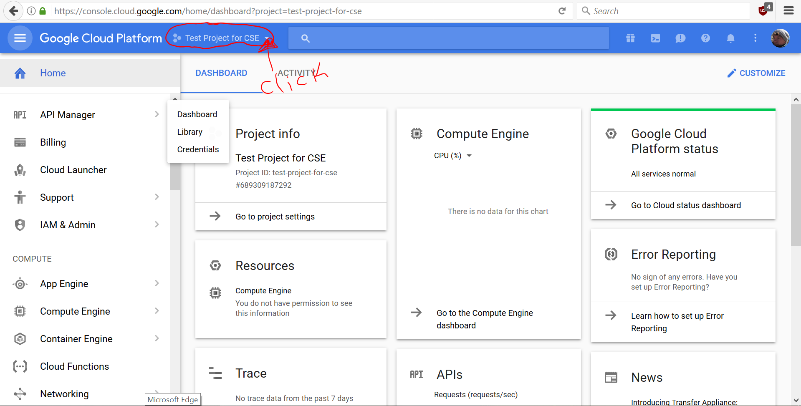
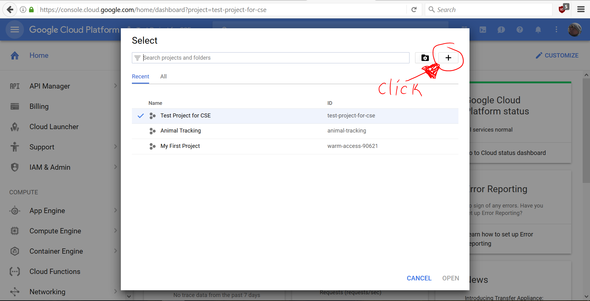
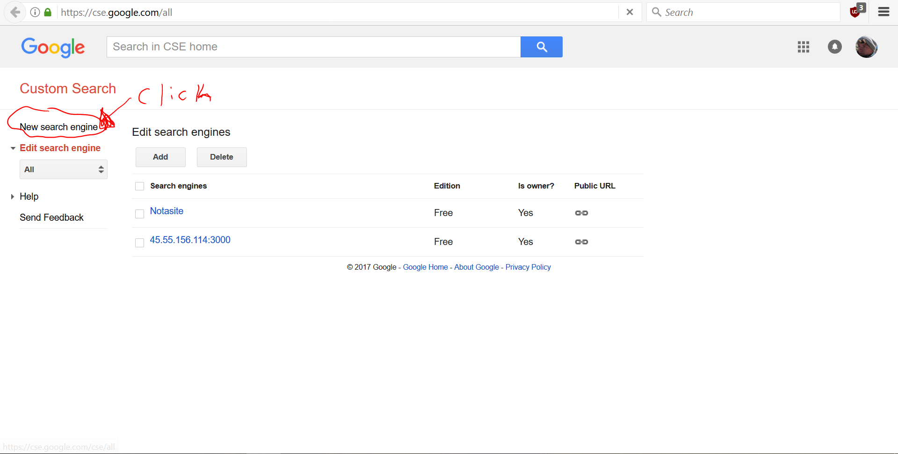
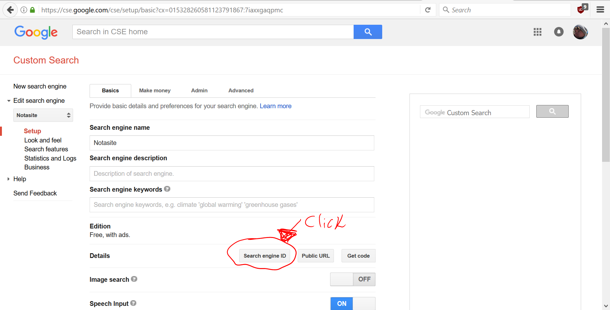
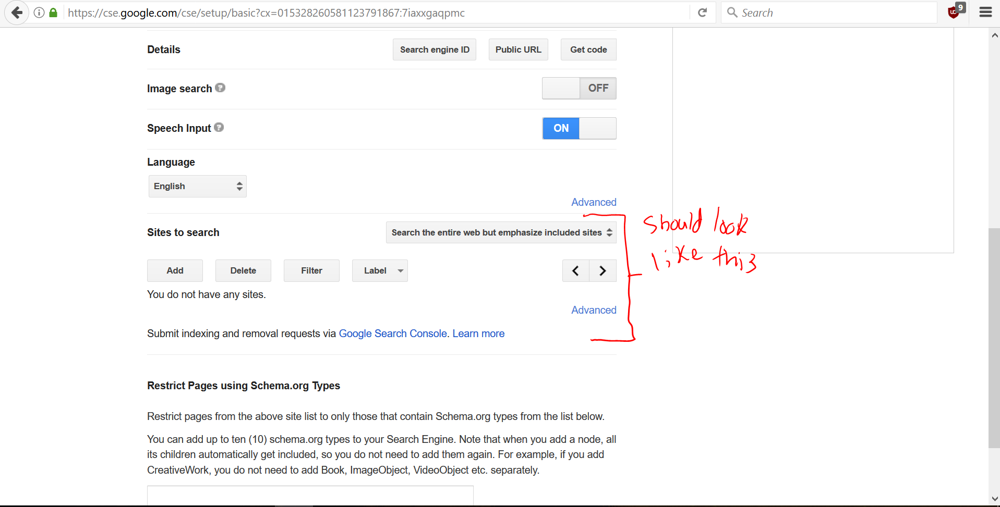
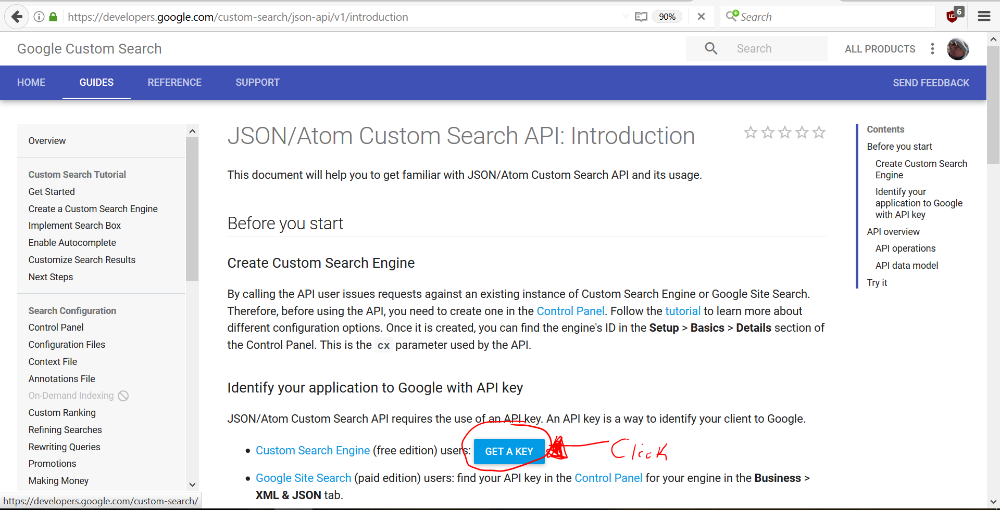
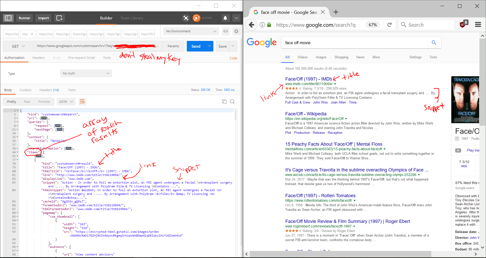

<!--Do not code this at all, but make sure devs answer how we're going to do each of these steps -->

## Homework: Requesting with Node

Tonight you need to use Node.js to make a request to Google's Custom Search API. You've used Google to search things, right? (Of course you have, you're a Googling Master!) The Google Custom Search API is the same except that we put our search info into the request's url, and the response we get back contains information about the search results.

Steps To Get The Google Custom Search API Working:
1. Sign into Gooogle

2. Go to this link https://console.cloud.google.com/home/dashboard and create a new project called "Requesting With Node"

3. Go to this link to create a "Custom Search Engine" https://cse.google.com/all, click "New Search Engine", enter "whatever.com" into the input, click "create"

4. Go to the control panel and copy that search engine's id into sublime (we'll use that later!)

5. Scroll down to "Sites to Search", delete the site you added, and change "Search only included sites" to "Search the entire web but emphasize included sites"

6. Go to this link https://developers.google.com/custom-search/json-api/v1/introduction, click the "Get a Key" button, choose the project you created called "Requesting With Node" and click "Enable API" to get the key. Copy that key!

7. Open Postman and send a GET request with this format: 
https://www.googleapis.com/customsearch/v1?key=yourKEY&cx=yourID&q=face+off+movie

8. I've minimized some of the JSON objects in the screenshot, but you'll know that your request worked if you see that the "items" array contains a list of search results! If something seems off, ask your neighbor for help!

Here's a resource for understanding how the JSON corresponds to what you see on Google in the browser. Here's the official documentation link too: https://developers.google.com/custom-search/json-api/v1/reference/cse/list 

Getting Started
- Fork and clone this repo.
- `npm install` to install `request`
- Define `movie.js` and an `app.js`.

#### movie.js

- The **movie** file will contain a **Module**.
- This module should *export* a function named `get(movieTitle)`.
- `get(movieTitle)` should make a *request* to the Google Custom Search API with the *movieTitle* as an argument.
	- **Hint:** what do you need to do to use the `request` library?
- You should parse the response that you receive and console.log() something from it. (Maybe each search item's snippet field or just the first one? The goal is to console.log() something received from the API for each movie.)
- You should test this file by running it with `node` to verify that it works!

#### app.js

- The **app** should *require* your movie module.
- You should define your `threeFavoriteMovies` as an array.
- You should then use the `Array.forEach()` function to loop through them.
- As you loop through them, you should call on your movie module's `get(movieTitle)`

#### Starter Code: app.js

There is some code in `app.js` to get you started, but you will need to write `movie.js` from scratch.

#### Deliverables

- app.js should require your movie module
- app.js should contain an array of movie titles
- for each movie title, app.js should call the get() function provided by the movie module
- the get() function should send a request to the Google Search API using the passed-in data (each movie title)
- the get() function's request should receive the response and console.log() <b>at least one property</b> from <b>at least one search result</n> in the items array.

#### Extras

- console.log() only information from search results that are from an imdb.com URL.
- Brainstorm ways that automated Google Searches could provide useful data for an app, or maybe with your first project.
- Read the Google Custom Search Documentation link provided above to learn more about the API's capabilities.
- Modify your get() function to send multiple requests to gather data from consecutive pages of results
